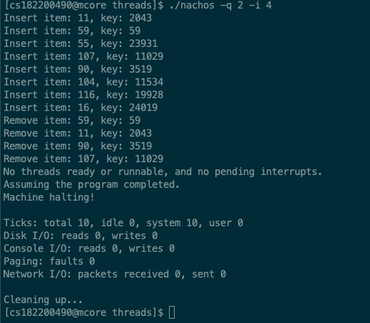
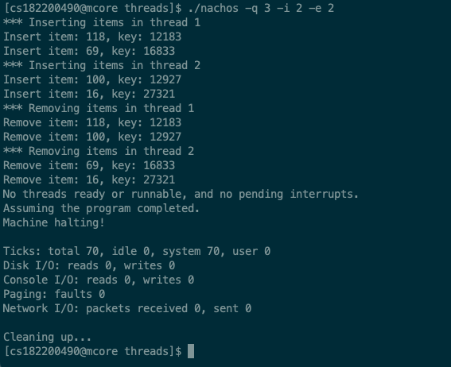
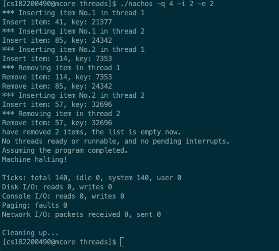
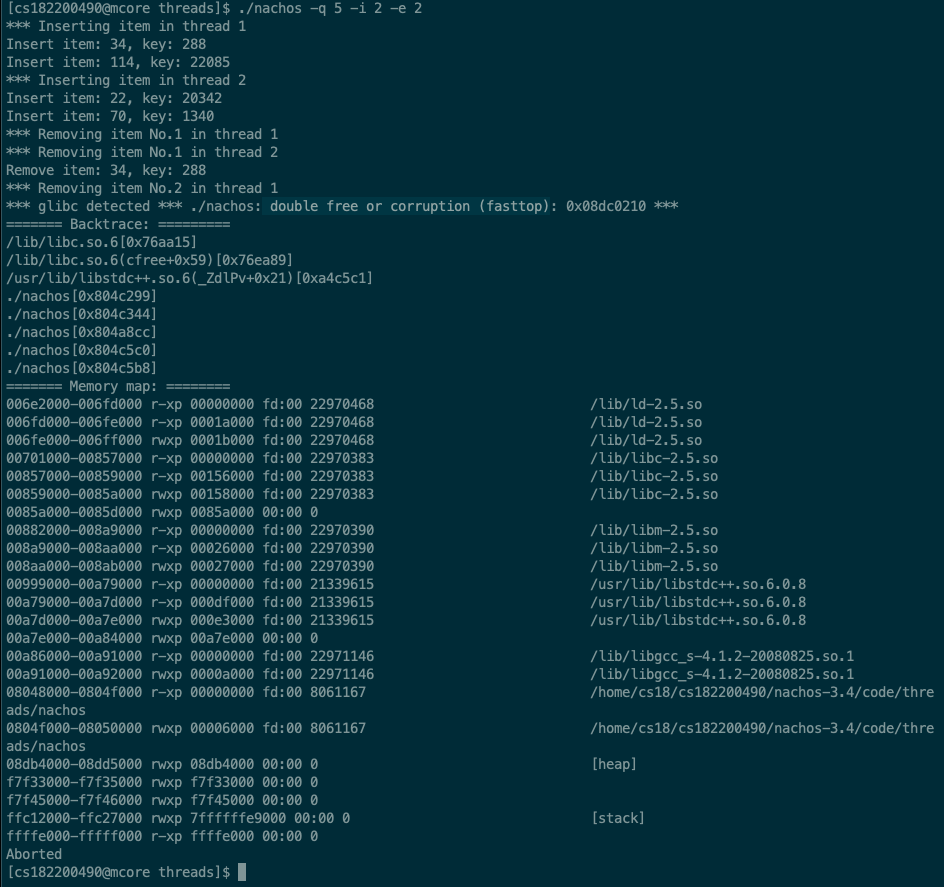
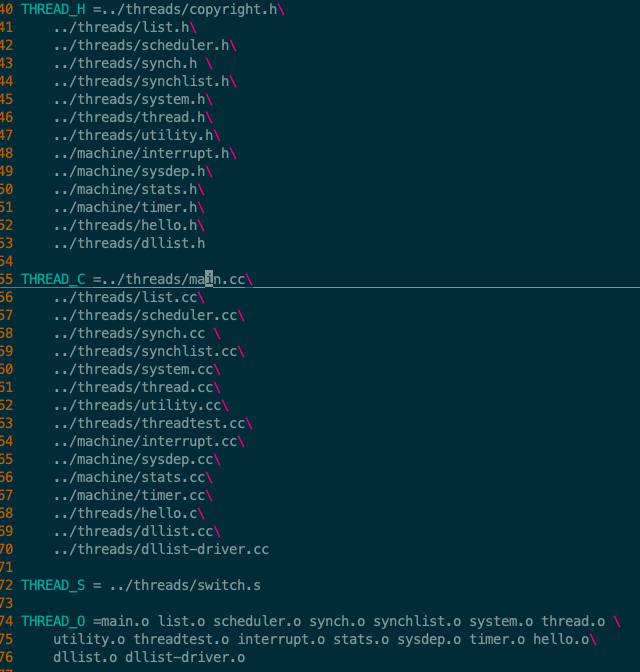
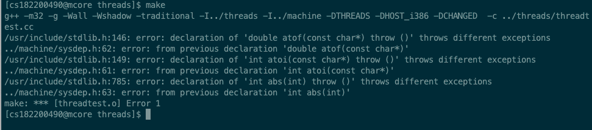

 实验一 体验Nachos下的并发程序设计
====

**小组成员：**

| 学号 | 姓名 | 专业 |
| --- | --- | --- | 
| 13720182200490 | 李少鹏 | 计算机 |
| 22920182204231 | 林枫 | 计算机 |
| 22920182204356 | 张加辉 | 计算机 | 

[一、实验内容简述](#实验内容简述)

[二、实验步骤与代码](#实验步骤与代码)

[三、遇到的问题与解决](#遇到的问题与解决)

[四、实验分工与小结](#实验分工与小结)

# 实验内容简述

本次实验的目的在于对nachos进行熟悉，并初步体验nachos下的并发程序设计。
实验内容分三部分：

- 安装nachos；
- 用C++实现双向有序链表；
- 在nachos系统中使用你所写的链表程序并演示一些并发错误。

#  实验步骤与代码

1. 用C++实现双向有序链表
	实现三个文件：`dllist.h`、`dllist.cc`、`dllist-driver.cc`
	
	1. `dllist.h`文件基本与英文文档中给出的一致
	2. `dllist.cc`具体实现
		**此处为初步实现，后续因需要与nachos联动设计并发错误，部分函数需要改动，见具体的相关文件**

		```cpp
		#include "dllist.h"
		// NULL's head file
		#include <cstring>
		
		DLLElement::DLLElement(void *itemPtr, int sortKey)
		{
		    item = itemPtr;
		    key = sortKey;
		    next = prev = NULL;
		}
		
		// init the dllist
		// DLList::DLList() : first(NULL), last(NULL){};
		DLList::DLList()
		{
		    first = new DLLElement();
		    last = new DLLElement();
		    first = last = NULL;
		}
		
		DLList::~DLList()
		{
		    DLLElement *item = first, *temp;
		    while(item)
		    {
		        temp = item->next;
		        delete item;
		        item = temp;
		    }
		}
		// add to head of list (set key = min_key - 1)
		void DLList::Prepend(void *item)
		{
		    if (IsEmpty())
		    {
		        DLLElement *new_item = new DLLElement(item, first->key - 1);
		        new_item->next = first;
		        first->prev = new_item;
		        first = new_item;
		    }
		    else
		    {
		        DLLElement *new_item = new DLLElement(item, min_key);
		        first = last = new_item;
		    }
		}
		// add to tail of list (set key = max_key + 1)
		void DLList::Append(void *item)
		{
		    if (IsEmpty())
		    {
		        DLLElement *new_item = new DLLElement(item, last->key + 1);;
		        new_item->prev = last;
		        last->next = new_item;
		        last = new_item;
		    }
		    else
		    {
		        DLLElement *new_item = new DLLElement(item, min_key);
		        first = last = new_item;
		    }
		}
		// remove from head of list
		// set *keyPtr to key of the removed item
		// return item (or NULL if list is empty)
		void *DLList::Remove(int *keyPtr)
		{
		    if (!IsEmpty())
		        return NULL;
		    void *res;
		    DLLElement *elem = first;
		    first = first->next;
		
		    first ? first->prev = NULL : first = last = NULL;
		    
		    elem->next = NULL;
		    *keyPtr = elem->key;
		    res = elem->item;
		    delete elem;
		    return res;
		}
		// return true if list has elements
		bool DLList::IsEmpty()
		{
		    return ((!first && !last) ? FALSE : TRUE);
		}
		// routines to put/get items on/off list in order (sorted by key)
		void DLList::SortedInsert(void *item, int sortKey)
		{
		    DLLElement *new_item = new DLLElement(item, sortKey);
		    if (!IsEmpty())
		    {
		        first = last = new_item;
		        return;
		    }
		    DLLElement *elem = first;
		    while(elem)
		    {
		        if(elem->key < sortKey)
		            elem = elem->next;
		        else
		            break;
		    }
		    if(elem)
		    {
		        new_item->next = elem;
		        if(elem != first)
		        {
		            new_item->prev = elem->prev;
		            elem->prev->next = new_item;
		            elem->prev = new_item;
		        }
		        else
		        {
		            elem->prev = new_item;
		            first = new_item;
		        }
		    }
		    else
		    {
		        last->next = new_item;
		        new_item->prev = last;
		        new_item->next = NULL;
		        last = new_item;
		    }
		}
		// remove first item with key==sortKey
		void *DLList::SortedRemove(int sortKey)
		{
		    if (!IsEmpty())
		        return NULL;
		    DLLElement *elem = first;
		    void *res;
		    while (elem != NULL && elem->key != sortKey)
		        elem = elem->next;
		    if (elem != NULL)
		    {
		        if (elem  == first)
		        {
		            first = elem->next;
		            if(first)
		                first->prev = NULL;
		            else
		                last = NULL;
		            elem->next = NULL;
		
		        }
		        else if(elem == last)
		        {
		            last = elem->prev;
		            last->next = NULL;
		            elem->prev = NULL;
		        }
		        else 
		        {
		            elem->prev->next = elem->next;
		            elem->next->prev = elem->prev;
		        }
		        res = elem->item;
		        delete elem;
		    }
		    return res;
		}
		```		
	3. `dllist-driver.cc`具体实现
		实验要求实现两个函数：向双向链表中随机插入指定个个元素`Generate_nItems`和从表头连续删除指定个元素`Remove_nItems`
		其中最后一个函数`Driver_test`是测试这两个函数的正确运行
		
		```cpp
		#include "dllist.h"
		#include <iostream>
		#include <cstdlib>
		#include <ctime>
		
		extern int itemNum;
		// generates N items with random keys
		// inserts them into a doubly-linked list
		void Generate_nItems(const int &N, DLList *list)
		{
			static int delta = 0;
			++delta;
		    srand(static_cast<unsigned>(time(0) + delta));
		    int nKey;
		    for(int i = 0; i < N; ++i)
		    {
		
		        int *nItem = new int();
		        nKey = rand() % (max_key + 1);
		        *nItem = nKey % 127;
		        std::cout << "Insert item: " << *nItem << ", key: " << nKey << std::endl;
		        list->SortedInsert(nItem, nKey);
		}
		}
		
		// removes N items starting from the head of the list 
		// prints out the removed items to the console
		void Remove_nItems(const int &N, DLList *list)
		{
		    void *nRes;
		    int nKey;
		    for(int i = 0; i < N; ++i)
		    {
		        nRes = list->Remove(&nKey);
		        if(nRes)
		            std::cout << "Remove item: " << *(int*)nRes << 
		            				", key: " << nKey << std::endl;
		        else
		        {
		            std::cout << "have removed " << i+1 << 
		            				" items, the list is empty now." << std::endl;
		            break;
		        }
		    }
		}
		
		void Driver_test()
		{
		    DLList *dList = new DLList;
		    Generate_nItems(2 * itemNum, dList);
		    Remove_nItems(itemNum, dList);
		}
		```
		
2. 修改`threadtest.cc`、`main.cc`
	
	1. `main.cc`中增加通过命令行传入的参数
		
		1. 其中`-q`是已经有的，表示测试选择，其后跟的整数表示测试序号`testnum`，默认测试序号为1。
			
			> 1 是未作任何修改的原本默认测试;
			> 2 是对上面编写的`dllist-driver.cc`中的两个函数的测试
			> 3 ~ 5 是设计的三种可能出现的问题。
		
		2. 增加`-i`，其后跟的整数表示设定的要操作的双向链表中item的个数`itemNum`，默认为2。
		3. 增加`-e`，其后跟的整数表示设定创建的线程thread个数`threadNum`，默认为2。
		
	2. 修改`threadtest.cc`
	
		1. 将原程序中的`Threadtest1`函数更名为`Test`并重载：
			1. 一个是传入无参数的函数指针——用于`dllist-driver.cc`中函数的测试；
			2. 一个是传入参数为`int`类型的函数指针——并通过变量`threadNum`控制创建的线程数
			
			
			```cpp
			void
			Test(VoidNoArgFunctionPtr functionPtr){ functionPtr(); }
			
			char msg[30] = "forked thread ";
			void
			Test(VoidFunctionPtr functionPtr)
			{
			    DEBUG('t', "Entering threadTest");
			    Thread *t;
			    char num[5];
			    for(int i = 0; i < threadNum; ++i)
			    {
			        sprintf(num, "%d", i + 1);
			        t = new Thread(strcat(msg, num));
					t->Fork(functionPtr, i + 1);
			    }
			}
			```
			
			其中利用`sprintf`函数实现将`int`转为`char`的字符串，并用`strcat`函数进行连接，形成每个线程的输出信息
		2. 修改`Threadtest`函数，以实现5种`-q`测试样例的选择
		
			```cpp
			void
			ThreadTest()
			{
			    switch (testnum) {
			        case 1:
			            Test(SimpleThread); break;
			        case 2:
			            Test(Driver_test); break;
			        case 3:
			            Test(Test1); break;
			        case 4:
			            Test(Test2); break;
			        case 5:
			            Test(Test3); break;
			        default:
			            printf("No test specified.\n");
			            break;
			    }
			}
			```
		
		3. 第一个是默认初始测试，第二个是测试`driver`的两个函数，后三个是设计的四种可能的问题
			1.  `Driver_test(){}`
				**代码：** 
				
				```cpp
				void Driver_test()
				{
				    DLList *dList = new DLList;
				    Generate_nItems(2 * itemNum, dList);
				    Remove_nItems(itemNum, dList);
				}
				```
				
				**测试：**
				终端输入`./nachos -q 2 -i 4`，选择2号测试，插入设定的8个item，删除设定的4个item
				**结果：**
				可见，成功插入8个item，然后按要求删除4个item
				
			2. `Test1(int which){}`
				
				**描述：** 并行执行时，线程A可能删除其他线程已经插入的元素。
				**实现：** 在一个线程插入完元素后，就使用`currentThread->Yield()`函数强制进行线程切换
				**代码：** 
				
				```cpp
				void
				Test1(int which)
				{
				    printf("*** Inserting items in thread %d\n", which);
				    Generate_nItems(itemNum, dList);
				    currentThread->Yield();
				    printf("*** Removing items in thread %d\n", which);
				    Remove_nItems(itemNum, dList);
				}
				```
				**测试：**
				终端输入`./nachos -q 3 -e 2 -i 2`，选择3号测试，创建2个线程，处理2个item
				**结果：**
				可见，线程 1 删除的`item`中有线程 2 中插入的元素，线程 2 删除的`item`中有线程 1 中插入的元素。
				
				
			2. `Test2(int which){}`
				
				**描述：** 并行执行时，线程在同一个位置插入元素，导致先插入的元素被覆盖
				**实现：** 在`dllist.cc`中的`SortedInsert`函数中，添加当双向链表为空时，插入成功前后进行线程强制转换`currentThread->Yield()`
				**代码：** 
				
				```cpp
				// dllist.cc
				void DLList::SortedInsert(void *item, int sortKey)
				{
				    DLLElement *new_item = new DLLElement(item, sortKey);
				    if (!IsEmpty())
				    {
				        if(testnum == 4)
				        {
				            currentThread->Yield();
							first = last = new_item;
							currentThread->Yield();
				        }
				        else
				            first = last = new_item;
				        return;
				    }
				    DLLElement *elem = first;
				    while(elem)
				    {
				        if(elem->key < sortKey)
				            elem = elem->next;
				        else
				            break;
				    }
				    if(elem)
				    {
				        new_item->next = elem;
				        if(elem != first)
				        {
				            new_item->prev = elem->prev;
				            elem->prev->next = new_item;
				            elem->prev = new_item;
				        }
				        else
				        {
				            elem->prev = new_item;
				            first = new_item;
				        }
				    }
				    else
				    {
				        last->next = new_item;
				        new_item->prev = last;
				        new_item->next = NULL;
				        last = new_item;
				    }
				}
				// threadtest.cc
				void
				Test2(int which)
				{
				    for(int i = 0; i < itemNum; ++i)
				    {
				        printf("*** Inserting item No.%d in thread %d\n", i + 1, which);
				        Generate_nItems(1, dList);
				    }
				    printf("*** Removing item in thread %d\n", which);
				    Remove_nItems(itemNum, dList);
				}
				```
				
				**测试：**
				终端输入`./nachos -q 4 -e 2 -i 2`，选择4号测试，创建2个线程，处理2个item
				**结果：**
				可见线程 1 插入的第一个`item`—41被覆盖为线程2插入的85
				
			3. `Test3(int which){}`
				
				**描述：** 并行执行时，线程可能删除的是同一个元素，当线程A删除后，后续线程就会出现重新删除的问题
				**实现：** 在删除时一个元素一个元素的删，修改`dllist.cc`中的`Remove`函数，当要删除时，调用`currentThread->Yield()`使多个线程同时删除，在碰到删除已删除的`item`时，使用`assert`输出相关信息。
				**代码：** 
				
				```cpp
				// dllist.cc
				void *DLList::Remove(int *keyPtr)
				{
				    if (!IsEmpty())
				        return NULL;
				    void *res;
				    DLLElement *elem = first;
				    if(testnum == 5)
				        currentThread->Yield();
				    
				    first = first->next;
				    if(first)
				    {
				        if(testnum == 5)
				            currentThread->Yield();
				        first->prev = NULL;
				    }
				    else
				        first = last = NULL;
				    
				    elem->next = NULL;
				    if(testnum == 5)
				        currentThread->Yield();
				    *keyPtr = elem->key;
				    res = elem->item;
				    delete elem;
				    return res;
				}

				
				// threadtest.cc
				void
				Test3(int which)
				{
				    printf("*** Inserting item in thread %d\n", which);
				    Generate_nItems(itemNum, dList);
				    currentThread->Yield();
				    for(int i = 0; i < itemNum; i++){
				        printf("*** Removing item No.%d in thread %d\n", i + 1, which);
				        Remove_nItems(1, dList);
				    }
				}
				```

				**测试：**
				终端输入`./nachos -q 5 -e 2 -i 2`，选择5号测试，创建2个线程，处理2个item
				**结果：**
				可见最后输出信息有`double free or corruption(fasttop)`，说明试图对一个地方进行两次`free`的操作，即重复删除
				
3. 修改`Makefile`
	本实验，我们新增加了头文件`dllist.h`、源程序`dllist.cc`、`dllist-driver.cc`，为使在平台上正确运行，需要在`code`目录下的`Makefile.common`中添加相关内容
		
	
	其中
	在`THREAD_H`中添加`dllist.h`，
	在`THREAD_C`中添加`dllist.cc`和`dllist-driver.cc`，
	在`THREAD_O`中添加`dllist.o`和`dllist-driver.o`
	

# 遇到的问题与解决

1. **问题：** 在实验的前半段编写测试`dllist.cc`、`dllist-driver.cc`时，出现过调用`Generate_nItems`函数插入的每个`DLLElement`的元素的`item`是绑定在了一起，最后插入的所有n个item存的内容都是一致的。
	**解决：** 在编写`DLList`的构造函数时，由于这个类的私有变量是指针，所以在编写其默认构造函数时不能仅将其赋值为`NULL`，要使用`new DLLElement()`对`first`和`last`进行初始化，给每一个`DLLElement`类型的变量分配空间。
	
	```cpp
	// init the dllist
	// DLList::DLList() : first(NULL), last(NULL){};
	DLList::DLList()
	{
	    first = new DLLElement();
	    last = new DLLElement();
	    first = last = NULL;
	}
	```
2.  **问题：** 初步修改代码`threadtest.cc`以及`main.cc`之后，在实验平台上测试进行`make`编译时遇到了错误

	```sh
	[cs182204356@mcore threads]$ make
	g++ -m32 -g -Wall -Wshadow -traditional -I../threads -I../machine -DTHREADS
		-DHOST_i386 -DCHANGED  -c ../threads/main.cc
	/usr/include/stdlib.h:146: 错误：‘double atof(const char*) throw ()’ 的声明抛出不同的异常
	../machine/sysdep.h:62: 错误：从先前的声明 ‘double atof(const char*)’
	/usr/include/stdlib.h:149: 错误：‘int atoi(const char*) throw ()’ 的声明抛出不同的异常
	../machine/sysdep.h:61: 错误：从先前的声明 ‘int atoi(const char*)’
	/usr/include/stdlib.h:785: 错误：‘int abs(int) throw ()’ 的声明抛出不同的异常
	../machine/sysdep.h:63: 错误：从先前的声明 ‘int abs(int)’
	make: *** [main.o] 错误 1
	```
	
	**解决**：
	在搜索无果后查看了`../machine/sysdep.h`里的内容，发现了这段代码：

	```c
	// Other C library routines that are used by Nachos.
	// These are assumed to be portable, so we don't include a wrapper.
	extern "C" {
	int atoi(const char *str);
	double atof(const char *str);
	int abs(int i);
	#include <stdio.h>              // for printf, fprintf
	#include <string.h>             // for DEBUG, etc.
	}
	```

	结合上面的错误提示，我猜测是因为C语言标准版本的不同导致在这里进行声明的三个函数与新标准的声明起了冲突，于是我就在这里将它们注释掉了。**注：实际上在这么做之后编译器又提示了位于`sysdep.cc`中的一些声明错误，我也将他们注释掉了，因为已经忘记了起冲突的准确位置所以这里就不贴代码了**

	经过几此编译测试，最后我又在这里加上了`#include <stdlib.h>`使这部分代码最终变成了这样：

	```c
	// Other C library routines that are used by Nachos.
	// These are assumed to be portable, so we don't include a wrapper.
	extern "C" {
	//int atoi(const char *str);
	//double atof(const char *str);
	//int abs(int i);
	#include <stdlib.h>
	#include <stdio.h>              // for printf, fprintf
	#include <string.h>             // for DEBUG, etc.
	}
	```
	到这里才终于让`make`能够正常地编译下去。
   
3. **问题：** 问题与上一个问题报错是一样的，但是感觉有些不一样
	
	可见都是报错`atoi`、`atof`、`abs`等函数的冲突报错，然而我出错的原因在于我在`threadtest.cc`文件中包含了`#include<iostream>`的头文件，起初我并没有找到什么资料，只是意外地通过删除了这个`iostream`头文件发现问题解决之后，就去测试设计的几个`Test`函数了，也没有去深究。
	
	**解决：** 直到后面和组员讨论在实验过程中遇到的问题时，发觉到我与上面的同学遇到了一个同样的问题，经过一番交流后，我想到了`c++`与`c`的头文件冲突问题。结合`nachos`这个实验项目的大部分`.cc`文件都会包含一个`system.h`文件，而`system.h`文件又会包含`sysdep.h`文件，在这之中被额外定义的`c library`应该是与`c++`的头文件/名称空间是有冲突的
	——--
	目前我也只是正在学习`c++`，只是知道如果有包含`iostream`就不要/不建议包含`.h`的头文件，取而代之用`c`开头的头文件。如，`#include <stdio.h>`改为`#include <cstdio>`。
	这个问题的解决我是采用：在`.cc`的源程序中，`system.h`与`iostream`不同时出现得以解决的。
	
	**再复盘：** 然而这个问题出现的根本在于，在本地对部分文件测试而非整个项目测试（起初本地`make`失败），所以会只包含自己所需要的头文件，而未考虑到`nachos`系统中的头文件格式。由于学校的`vpn`不是很稳定（至少我们这个小组里面，有两个人都有出现不稳定的问题），我尝试在自己电脑上配置环境，而由于mac中提供的`gcc-4.2.1`是被`clang`封装过的，无法通过`make`中的`-traditionnal`这个选项（在最近的上面的图中我有标注），而我装的原生的`gcc`会存在部分头文件找不到的问题，目前还未解决。最后我在ubuntu20.04的虚拟机上得以解决，由于实验平台上的`gcc`版本最高是4.1.2不支持`c++11`，所以在本地的ubuntu上的`makefile`中需要修改`cc`的编译参数，添加`-std=c98`的选项，现在得以实现本地`make`，但解决这个问题后已经是实验临近结束了。。不过后面的实验应该这种配置环境、`gcc`版本问题、`c`与`c++`的兼容性等问题会少一些。
	
# 实验分工与小结

1. 任务分工

	此次实验是第一次实验，我们对于`nachos`这个系统起初也是相当陌生，且对于`c++`的一些深层次的知识（包括`c`）也没有掌握，所以整个实验过程中，我们的分工并没有很明确，对于最终代码的整合也做的不是很高效，后续我们会尝试使用`github`来管理我们的实验，以便更好的做实验
	
2. 小结

	通过这次实验，我们对 `nachos` 的整体状况有了初步了解，对其线程子系统、调度，`make`的相关知识有了更深一步的学习。我们通过设计并行出错情况，进行线程调度，对操作系统中的线程与线程控制概念也有了更进一步的理解。
	但是这次实验设计的出错情况不是很多，这表明我们的分析还不到位，对操作系统的线程调度相关知识掌握的也不是很深刻，我们还需要进一步的努力学习。